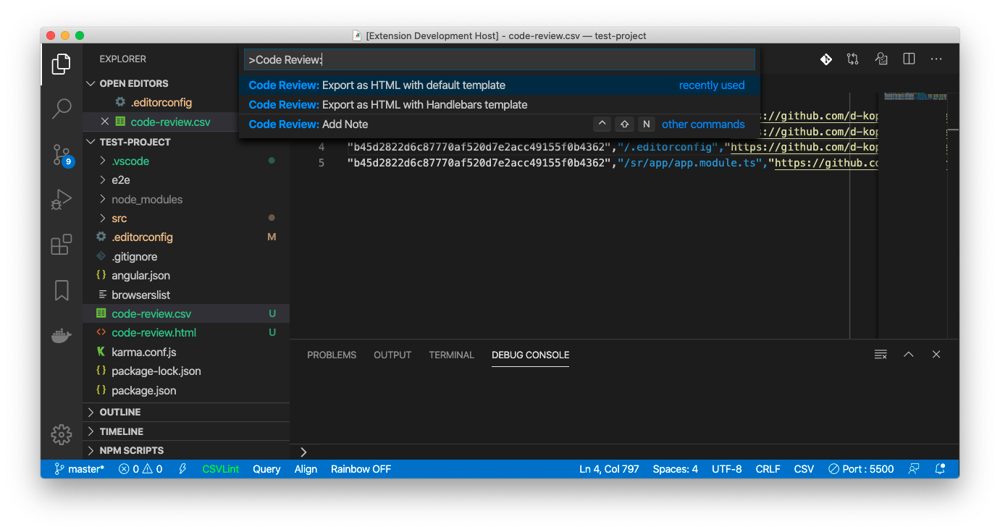
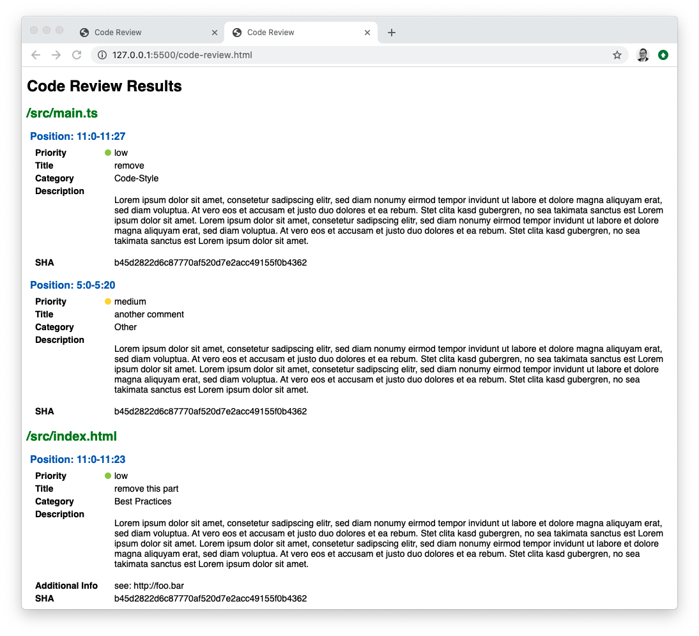
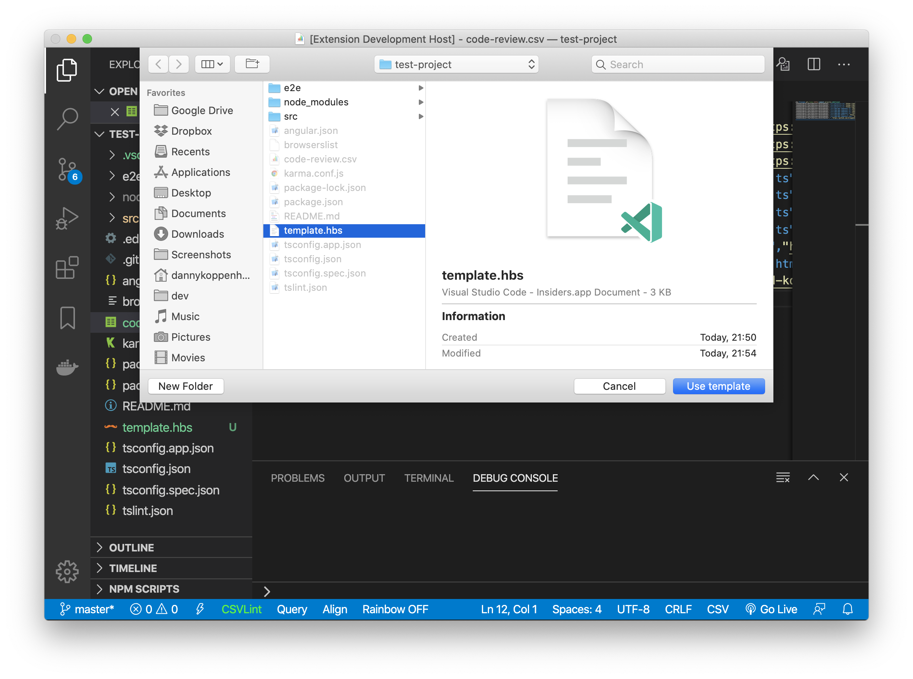
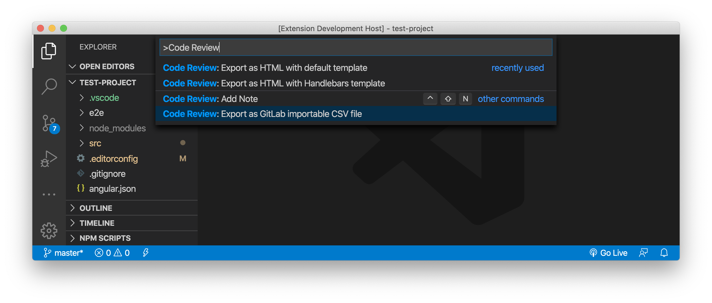
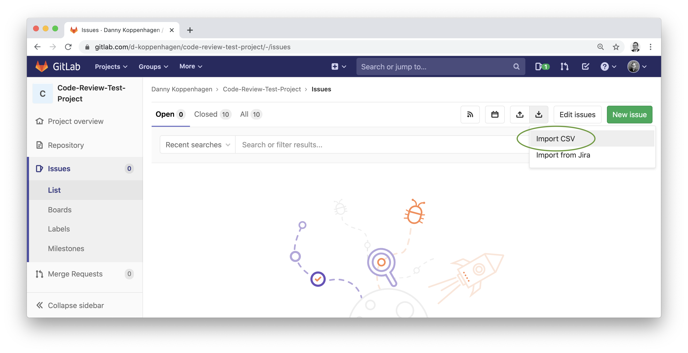
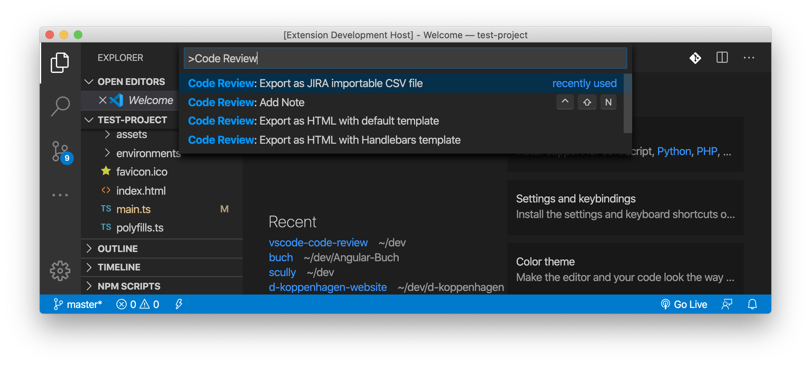

# vscode-code-review

[](https://marketplace.visualstudio.com/items?itemName=d-koppenhagen.vscode-code-review)
[](http://makeapullrequest.com)
[](https://github.com/ellerbrock/open-source-badge/)

This extension allows you to create a code review file you can hand over to a customer.

## Features

### create review notes

Simply right click somewhere in the opened file and choose the option "Code Review: Add Note".
You will be prompted for your note you wanna add.
A file `code-review.csv` will be created containing your comments and the file and line references.

The result will look like this:

```csv
sha,filename,url,lines,title,comment,priority,additional
"b45d2822d6c87770af520d7e2acc49155f0b4362","/test/a.txt","https://github.com/d-koppenhagen/vscode-code-review/tree/b45d2822d6c87770af520d7e2acc49155f0b4362/test/a.txt","1:2-4:3","foo","this should be refactored",1,"see http://foo.bar"
"b45d2822d6c87770af520d7e2acc49155f0b4362","/test/b.txt","https://github.com/d-koppenhagen/vscode-code-review/tree/b45d2822d6c87770af520d7e2acc49155f0b4362/test/b.txt","1:0-1:4|4:0-4:3","bar","wrong format",1,""
```

The line column indicates an array of selected ranges or cursor positions separated by a `|` sign.
E.g. `"1:0-1:4|4:0-4:3"` means that the comment is related to the range marked from line 1 position 0 to line 1 position 4 and line 4 position 0 to line 4 position 3.


### export created notes as HTML

Once you finished your review and added your notes, you can export the results as an HTML report.
Therefore open the [VSCode Command Palette](https://code.visualstudio.com/docs/getstarted/tips-and-tricks#_command-palette) (macOS: ⇧+⌘+P, others: ⇧+Ctrl+P) and search for "Code Review":



#### Default template

When you choose to generate the report using the default template, it will look like this in the end:



#### Custom handlebars template

You can also choose to export the HTML report by using a custom [Handlebars](https://handlebarsjs.com/) template.
One you choose this option you cot prompted to choose the template file (file extension must be either `*.hbs`, `*.handlebars`, `*.html` or `*.htm`)



The used structure to fill the template placholders is an array of [`ReviewFileExportSection`](https://github.com/d-koppenhagen/vscode-code-review/blob/master/src/interfaces.ts#L31-L44).

Check out the example template file 
[`template.example.hbs`](https://github.com/d-koppenhagen/vscode-code-review/blob/master/template.example.hbs), to see how your template should basically look like.

### Export for Issue Tracking System

#### export created notes as GitLab importable CSV file

Once you finished your code review, you can export the results to a formatted csv file that's [importable into Gitlab issues](https://docs.gitlab.com/ee/user/project/issues/csv_import.html).



Once exported, you can imported the file in the GitLab project



#### export created notes as JIRA importable CSV file

You can also export the notes as a CSV file to [import them into your JIRA issue tracking system](https://confluence.atlassian.com/adminjiracloud/importing-data-from-csv-776636762.html).



## Extension Settings

The following settings can be adjusted via the configuration file `.vscode/settings.json` or globally when configuring vscode.
The listing below shows the default configuration:

```json
{
  // filename will lead into "code-review.csv"
  "code-review.filename": "code-review",
  // CSV column "url" will contain the remote link like this: "https://github.com/foo/bar/tree/e023a1831a3d5299407cac4379e83df07b383475/foo/bar.txt
  // If the project is not a git project, the SHA is empty (e.g. "code-review.baseUrl": "https://my-url/" => will become: "https://my-url/foo/bar.txt)
  "code-review.baseUrl": "https://github.com/foo/bar/tree/"
}
```

## Keybindings

To easily add a *new* comment, you can use the keybinding combination `ctrl` + ⇧ + `n`.

## The review approach

If you got a customer request for doing a code review you will ideally receive read access to it's github / gitlab repoistory or similar.
To create a code review with a report you should install this extension and go on with the following steps:

- Download / clone the customer code and checkout the correct branch
- Open the project in vscode
- [Configure th `baseURL` option](#extension-settings) with the remote URL
  - this will cause that the link in the report is generate with the correct target including SHA, file and line reference
- [Start creating your review notes](#create-review-notes).
- [Export the report](#export-created-notes-as-html).
  - [Probably create an own template first](#custom-handlebars-template)
- Send it to the customer or [import the notes in your issue tracking system](#export-for-issue-tracking-system) and make the customer happy ♥️

**Enjoy!**
